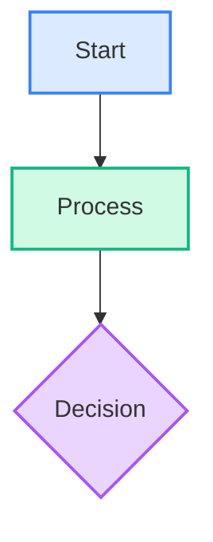
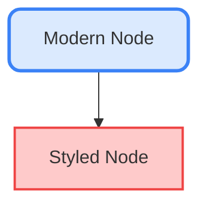
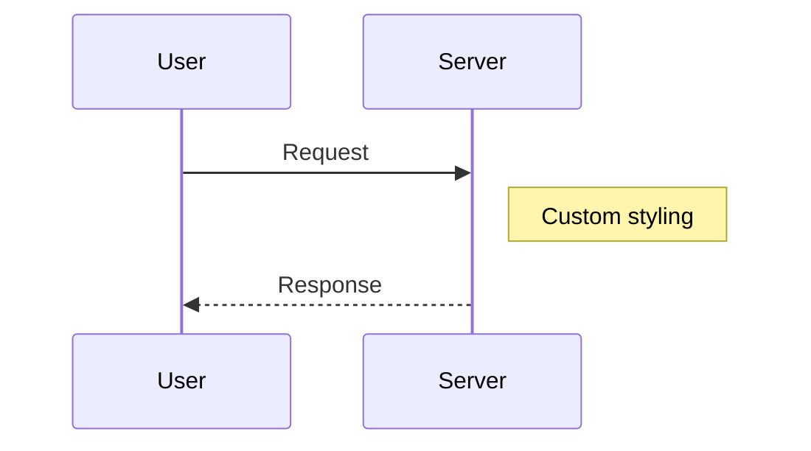
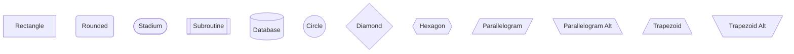

# Mermaid Diagram Customization Guide

## Overview

Mermaid provides extensive customization options for styling nodes, edges, and containers. The implementation now uses a custom theme that matches your app's design system.

---

## Current Custom Styling

### Applied Theme Variables

The diagrams now use these custom colors:

#### Light Mode:
- **Node Fill**: `rgba(59, 130, 246, 0.1)` - Subtle blue background
- **Node Border**: `#3b82f6` - Blue border
- **Node Text**: `#1f2937` - Dark gray text
- **Edges**: `#6b7280` - Medium gray lines
- **Border Radius**: `8px` - Rounded corners

#### Dark Mode:
- **Node Fill**: `rgba(59, 130, 246, 0.15)` - Slightly brighter blue background
- **Node Border**: `#60a5fa` - Lighter blue border
- **Node Text**: `#f3f4f6` - Light gray text
- **Edges**: `#9ca3af` - Lighter gray lines

---

## Customization Methods

### 1. **Theme Variables** (Currently Used) ⭐

The easiest way to customize. Override CSS variables in `mermaid.initialize()`:

```typescript
mermaid.initialize({
  theme: 'base',
  themeVariables: {
    primaryColor: '#your-color',
    primaryBorderColor: '#your-border',
    lineColor: '#your-line-color',
    // ... more variables
  }
});
```

### 2. **Inline Styles in Diagram Syntax**

You can style individual nodes directly in the mermaid code:

````markdown

````

### 3. **Custom CSS** (Advanced)

Add custom CSS to override mermaid's generated classes:

```css
/* In SidePanel.css */
.mermaid-block svg .node rect {
  fill: rgba(59, 130, 246, 0.1) !important;
  stroke: #3b82f6 !important;
  stroke-width: 2px !important;
  rx: 8px !important; /* Border radius */
}

.mermaid-block svg .node text {
  fill: #1f2937 !important;
  font-family: system-ui !important;
}

.mermaid-block svg .edgePath path {
  stroke: #6b7280 !important;
  stroke-width: 2px !important;
}
```

---

## Available Theme Variables

### Node Colors
```typescript
{
  // Primary nodes
  primaryColor: 'fill color',
  primaryTextColor: 'text color',
  primaryBorderColor: 'border color',
  
  // Secondary nodes (alt colors)
  secondaryColor: 'fill color',
  secondaryTextColor: 'text color',
  secondaryBorderColor: 'border color',
  
  // Tertiary nodes (third color)
  tertiaryColor: 'fill color',
  tertiaryTextColor: 'text color',
  tertiaryBorderColor: 'border color',
}
```

### Edge/Line Styling
```typescript
{
  lineColor: 'edge line color',
  edgeLabelBackground: 'label background',
  clusterBkg: 'subgraph background',
  clusterBorder: 'subgraph border',
}
```

### Text & Font
```typescript
{
  fontSize: '14px',
  fontFamily: 'system-ui, sans-serif',
  primaryTextColor: '#1f2937',
  secondaryTextColor: '#6b7280',
}
```

### Shapes & Borders
```typescript
{
  nodeRadius: 8, // Border radius for rectangles
  nodeBorder: 'solid', // Border style
}
```

---

## Diagram-Specific Styling

### Flowcharts
````markdown

````

### Sequence Diagrams
````markdown

````

**Theme Variables for Sequence Diagrams:**
```typescript
{
  actorBkg: 'actor box background',
  actorBorder: 'actor box border',
  actorTextColor: 'actor text color',
  actorLineColor: 'lifeline color',
  signalColor: 'arrow color',
  signalTextColor: 'label color',
}
```

### State Diagrams
```typescript
{
  labelColor: 'state label color',
  stateBorder: 'state border color',
  stateBkg: 'state background',
}
```

### Class Diagrams
```typescript
{
  classText: 'class name color',
  nodeBorder: 'class box border',
  mainBkg: 'class box background',
}
```

---

## Color Palette Examples

### Option 1: Blue Theme (Current)
```typescript
primaryColor: 'rgba(59, 130, 246, 0.1)',
primaryBorderColor: '#3b82f6',
lineColor: '#6b7280',
```

### Option 2: Green Theme
```typescript
primaryColor: 'rgba(16, 185, 129, 0.1)',
primaryBorderColor: '#10b981',
lineColor: '#059669',
```

### Option 3: Purple Theme
```typescript
primaryColor: 'rgba(168, 85, 247, 0.1)',
primaryBorderColor: '#a855f7',
lineColor: '#9333ea',
```

### Option 4: Monochrome
```typescript
primaryColor: 'rgba(156, 163, 175, 0.1)',
primaryBorderColor: '#6b7280',
lineColor: '#4b5563',
```

---

## Advanced Customization

### Custom Node Shapes

Mermaid supports various node shapes:

````markdown

````

### Gradient Fills (Requires CSS)

```css
.mermaid-block svg .node rect {
  fill: url(#gradient) !important;
}

.mermaid-block svg defs {
  background: linear-gradient(135deg, #667eea 0%, #764ba2 100%);
}
```

### Animated Edges

```css
.mermaid-block svg .edgePath path {
  stroke-dasharray: 5;
  animation: dash 1s linear infinite;
}

@keyframes dash {
  to {
    stroke-dashoffset: -10;
  }
}
```

---

## Configuration File

For consistent styling across all diagrams, you can create a config:

```typescript
const MERMAID_CONFIG = {
  theme: 'base',
  themeVariables: {
    // Your custom variables
  },
  flowchart: {
    curve: 'basis', // Edge curve style: basis, linear, cardinal
    padding: 20,
    nodeSpacing: 50,
    rankSpacing: 50,
  },
  sequence: {
    actorMargin: 50,
    boxMargin: 10,
    boxTextMargin: 5,
  },
};

mermaid.initialize(MERMAID_CONFIG);
```

---

## Complete Theme Variable Reference

### All Available Variables

```typescript
themeVariables: {
  // Background
  background: '#ffffff',
  mainBkg: '#f9fafb',
  secondBkg: '#f3f4f6',
  tertiaryBkg: '#e5e7eb',
  
  // Primary
  primaryColor: '#dbeafe',
  primaryTextColor: '#1f2937',
  primaryBorderColor: '#3b82f6',
  
  // Secondary  
  secondaryColor: '#d1fae5',
  secondaryTextColor: '#1f2937',
  secondaryBorderColor: '#10b981',
  
  // Tertiary
  tertiaryColor: '#e9d5ff',
  tertiaryTextColor: '#1f2937',
  tertiaryBorderColor: '#a855f7',
  
  // Lines & Edges
  lineColor: '#6b7280',
  textColor: '#1f2937',
  edgeLabelBackground: '#ffffff',
  
  // Nodes
  nodeBorder: '#3b82f6',
  nodeRadius: 8,
  
  // Clusters (Subgraphs)
  clusterBkg: '#f9fafb',
  clusterBorder: '#d1d5db',
  
  // Font
  fontFamily: 'system-ui, -apple-system, sans-serif',
  fontSize: '14px',
  
  // Sequence Diagrams
  actorBkg: '#dbeafe',
  actorBorder: '#3b82f6',
  actorTextColor: '#1f2937',
  actorLineColor: '#d1d5db',
  signalColor: '#6b7280',
  signalTextColor: '#1f2937',
  labelBoxBkgColor: '#f3f4f6',
  labelBoxBorderColor: '#d1d5db',
  labelTextColor: '#1f2937',
  loopTextColor: '#1f2937',
  noteBorderColor: '#f59e0b',
  noteBkgColor: '#fef3c7',
  noteTextColor: '#78350f',
  activationBorderColor: '#3b82f6',
  activationBkgColor: '#eff6ff',
  
  // State Diagrams
  labelColor: '#1f2937',
  altBackground: '#f3f4f6',
  errorBkgColor: '#fee2e2',
  errorTextColor: '#dc2626',
  
  // Class Diagrams
  classText: '#1f2937',
  
  // Git Graphs
  git0: '#3b82f6',
  git1: '#10b981',
  git2: '#f59e0b',
  git3: '#ef4444',
  git4: '#8b5cf6',
  git5: '#ec4899',
  git6: '#06b6d4',
  git7: '#84cc16',
  
  // Pie Charts
  pie1: '#3b82f6',
  pie2: '#10b981',
  pie3: '#f59e0b',
  pie4: '#ef4444',
  pie5: '#8b5cf6',
  pie6: '#ec4899',
  pie7: '#06b6d4',
  pie8: '#84cc16',
  pie9: '#f97316',
  pie10: '#06b6d4',
  pie11: '#a855f7',
  pie12: '#14b8a6',
}
```

---

## Tips & Best Practices

### 1. **Maintain Contrast**
Ensure text remains readable:
- Light mode: Dark text on light backgrounds
- Dark mode: Light text on dark backgrounds

### 2. **Use Transparency**
For a modern look, use `rgba()` with alpha < 0.3 for fills

### 3. **Consistent Colors**
Use your app's color palette for brand consistency

### 4. **Border Radius**
Set `nodeRadius: 8` for modern, rounded corners

### 5. **Line Thickness**
2-3px stroke width works well for most diagrams

### 6. **Font Matching**
Use `fontFamily: 'inherit'` to match your app's fonts

---

## How to Modify

To change the styling, edit `MermaidBlock.tsx`:

```typescript
mermaid.initialize({
  theme: 'base',
  themeVariables: {
    // Modify these values
    primaryColor: 'your-color',
    primaryBorderColor: 'your-border',
    // ...
  }
});
```

Reload the extension to see changes!

---

## Resources

- [Mermaid Theme Configuration](https://mermaid.js.org/config/theming.html)
- [Mermaid Theme Variables](https://github.com/mermaid-js/mermaid/blob/develop/packages/mermaid/src/themes/theme-base.js)
- [Styling Examples](https://mermaid.live/)
- [Advanced Theming](https://mermaid.js.org/config/theming.html#theme-variables)

---

**Current Status**: ✅ Custom styling applied that matches your app's design system with subtle transparency and modern aesthetics!

