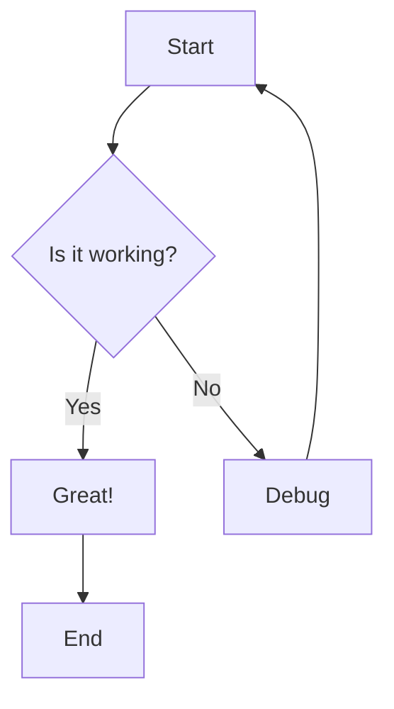
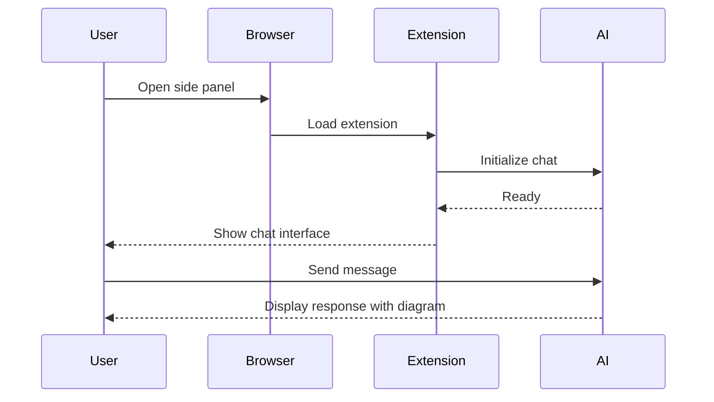
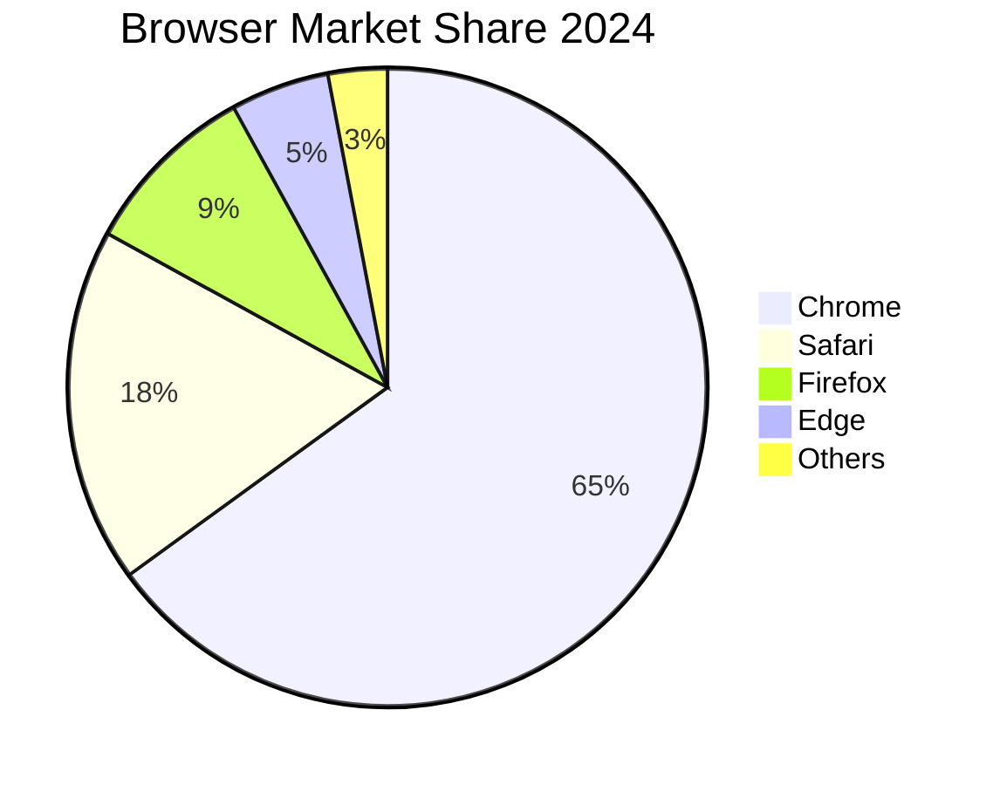
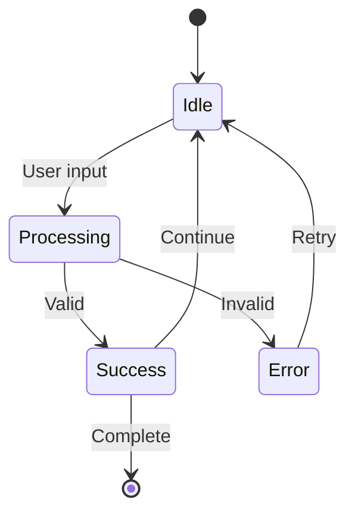
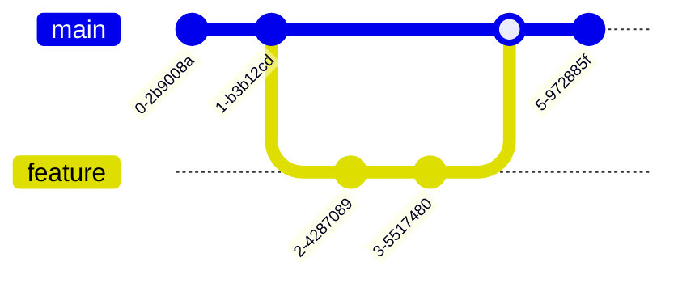
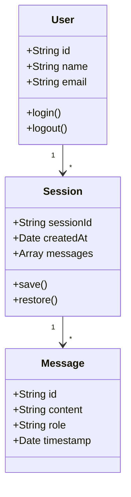
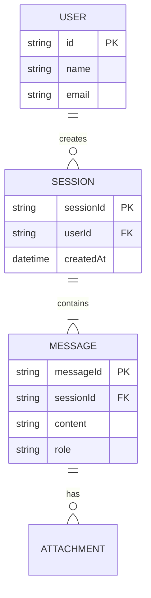
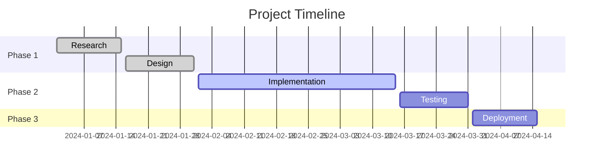
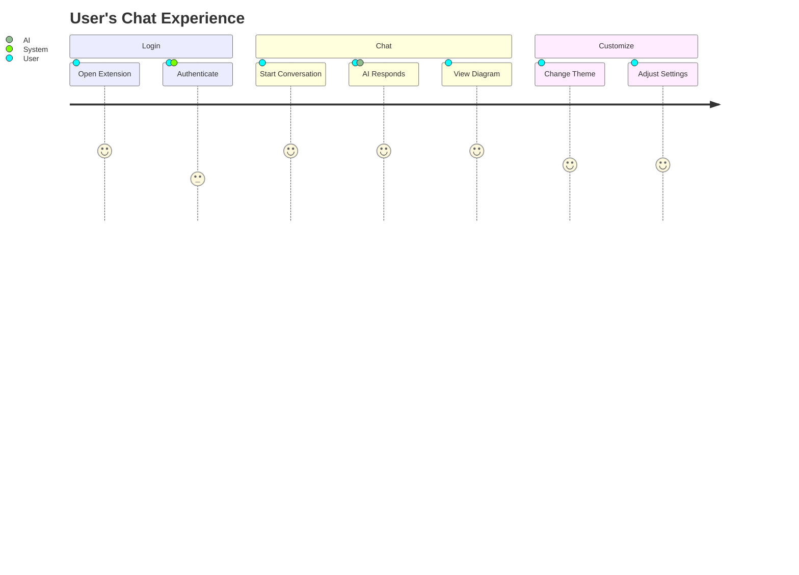

# Mermaid Diagram Test Examples

This file contains various Mermaid diagrams to test the implementation.

## Test 1: Simple Flowchart

````markdown

````

## Test 2: Sequence Diagram

````markdown

````

## Test 3: Simple Pie Chart

````markdown

````

## Test 4: State Diagram

````markdown

````

## Test 5: Custom Tag Method (CopilotKit only)

```xml
<mermaid>
graph LR
    A[Custom Tag] --> B[MermaidBlock]
    B --> C[Rendered Diagram]
</mermaid>
```

## Test 6: Git Graph

````markdown

````

## Test 7: Complex Class Diagram

````markdown

````

## Test 8: Entity Relationship Diagram

````markdown

````

## Test 9: Gantt Chart

````markdown

````

## Test 10: Journey Diagram

````markdown

````

## Test 11: Error Case (Invalid Syntax)

This should show an error with helpful message:

````markdown
```mermaid
graph TD
    A[Start
    B[Missing bracket]
```
````

## Instructions for Testing

1. **Install dependencies**:
   ```bash
   pnpm install
   ```

2. **Run development server**:
   ```bash
   pnpm dev
   ```

3. **Test in chat**:
   - Open the browser extension
   - Go to the side panel
   - Start a chat session
   - Paste any of the examples above
   - AI should render the diagram

4. **Test with AI generation**:
   Ask the AI:
   - "Create a flowchart showing user authentication"
   - "Draw a sequence diagram for API calls"
   - "Generate a class diagram for a todo app"

5. **Test theme switching**:
   - Toggle between light and dark mode
   - Diagrams should adapt automatically

6. **Test error handling**:
   - Try Test 11 (invalid syntax)
   - Should show error message with collapsible code

## Expected Behavior

### ✅ Success Indicators
- Diagrams render correctly
- Theme switches automatically (light/dark)
- Loading states show briefly
- No console errors

### ❌ Failure Indicators
- "Loading diagram..." never completes
- Red error boxes appear
- Console shows mermaid errors
- Blank spaces where diagrams should be

## Troubleshooting

If diagrams don't render:

1. Check browser console for errors
2. Verify mermaid dependency is installed
3. Check if code block has correct language tag
4. Try simpler diagrams first
5. Test with both methods (code block and custom tag)

