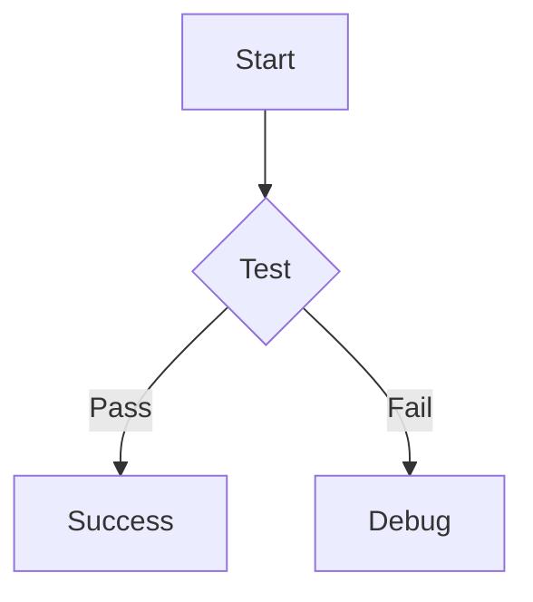

# Mermaid Rendering Fix

## Issue
Mermaid code blocks were being displayed as syntax-highlighted code instead of rendered diagrams in chat messages.

## Root Cause
CopilotKit's `Markdown` component uses the `components` prop which accepts:
1. **Custom tag renderers** (like `<think>`, `<mermaid>`) - for XML-style tags
2. **Standard markdown element renderers** (like `code`, `p`, `a`) - for markdown syntax

We initially only added `mermaid` as a custom tag renderer, but we also needed to add a `code` renderer to intercept code blocks with `language-mermaid`.

## Solution
Updated `CustomAssistantMessage.tsx` to extend `markdownTagRenderers` with a `code` component that:
1. Detects code blocks with `language-mermaid`
2. Renders them using `<MermaidBlock>` instead of default code highlighting
3. Falls back to default code rendering for other languages

### Code Changes

```typescript
// Added import
import { MermaidBlock } from './MermaidBlock';

// Added code renderer
const extendedMarkdownRenderers = useMemo(() => {
  return {
    ...markdownTagRenderers,
    // Add code block renderer for mermaid diagrams
    code: ({ node, inline, className, children, ...props }: any) => {
      const match = /language-(\w+)/.exec(className || '');
      const language = match ? match[1] : '';
      
      // Handle mermaid diagrams
      if (language === 'mermaid' && !inline) {
        return <MermaidBlock>{String(children)}</MermaidBlock>;
      }
      
      // Return default code rendering for other languages
      return inline ? (
        <code className={className} {...props}>
          {children}
        </code>
      ) : (
        <code className={className} {...props}>
          {children}
        </code>
      );
    },
  };
}, [markdownTagRenderers]);

// Use extended renderers
<Markdown content={content} components={extendedMarkdownRenderers} />
```

## Testing

### Test 1: Simple Flowchart
Send this in chat:
````markdown

````

**Expected**: Rendered flowchart diagram  
**Before Fix**: Syntax-highlighted code

### Test 2: Custom Tag (Should Still Work)
````markdown
<mermaid>
graph LR
    A --> B --> C
</mermaid>
````

**Expected**: Rendered flowchart diagram

### Test 3: Other Code Blocks (Should Not Break)
````markdown
```javascript
console.log('Hello World');
```
````

**Expected**: Syntax-highlighted JavaScript code

## How to Test

1. **Restart dev server** (if running):
   ```bash
   cd /Users/hnankam/Downloads/data/project-hands-off
   pnpm dev
   ```

2. **Reload extension** in browser

3. **Open side panel** and start a new chat

4. **Send test message**:
   ````markdown
   ```mermaid
   graph TD
       A[Chrome Extension] --> B[Side Panel]
       B --> C[Chat Interface]
       C --> D[Mermaid Rendering]
   ```
   ````

5. **Verify**: Should see a rendered flowchart, not code

## Verification Checklist

- [ ] Simple flowchart renders correctly
- [ ] Complex diagrams (sequence, class, etc.) render
- [ ] Theme switching works (light/dark)
- [ ] Error handling shows for invalid syntax
- [ ] Custom `<mermaid>` tags still work
- [ ] Other code blocks still syntax-highlighted
- [ ] No console errors

## Architecture Notes

### Component Flow

```
AI Response with mermaid code block
            ↓
CustomAssistantMessage
            ↓
CopilotKit Markdown component
            ↓
extendedMarkdownRenderers.code() ← Detects language-mermaid
            ↓
MermaidBlock component
            ↓
Rendered SVG diagram
```

### Two Rendering Paths

1. **Code Block Path** (Fixed):
   ` ```mermaid ... ``` ` → `code` renderer → `MermaidBlock`

2. **Custom Tag Path** (Already Working):
   `<mermaid>...</mermaid>` → `mermaid` tag renderer → `MermaidBlock`

## Additional Notes

- The `code` renderer is memoized with `useMemo` for performance
- Falls back to default code rendering for non-mermaid languages
- Works for both inline and block code (checks `!inline` for mermaid)
- Compatible with CopilotKit's markdown processing

## Related Files

- `/pages/side-panel/src/components/CustomAssistantMessage.tsx` - **Fixed**
- `/pages/side-panel/src/components/MermaidBlock.tsx` - Unchanged
- `/pages/side-panel/src/components/tiptap/MarkdownRenderer.tsx` - Already working
- `/pages/side-panel/src/components/ChatInner.tsx` - Custom tag config

## Status

✅ **FIXED** - Mermaid code blocks now render correctly in chat messages

