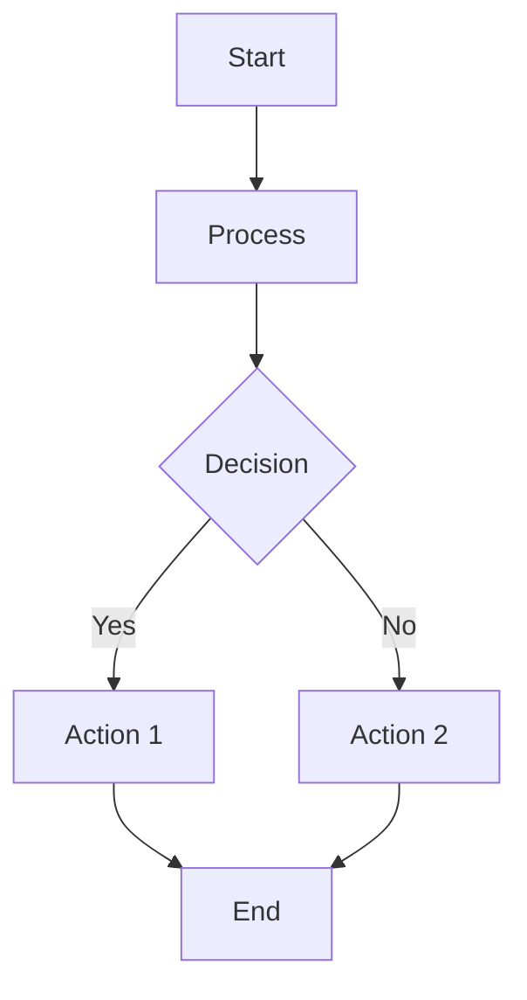
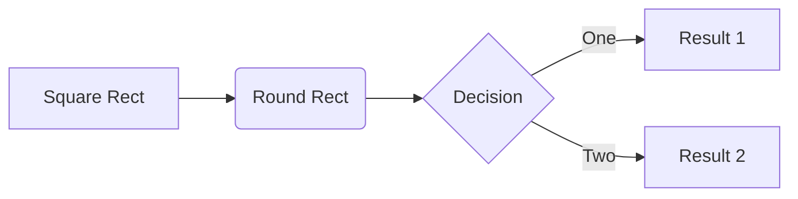
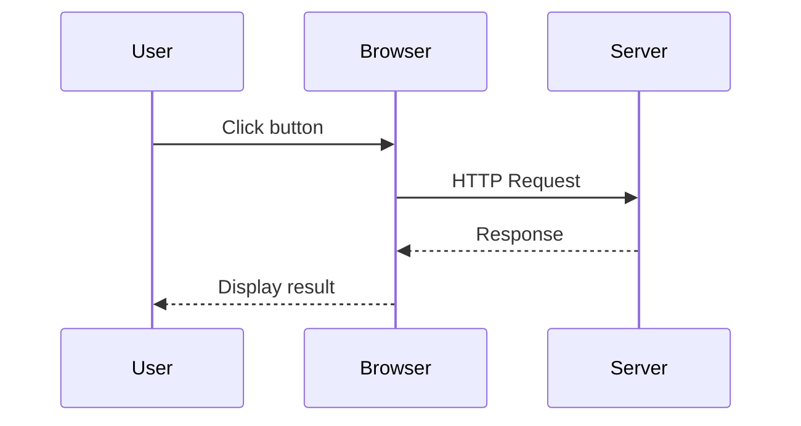
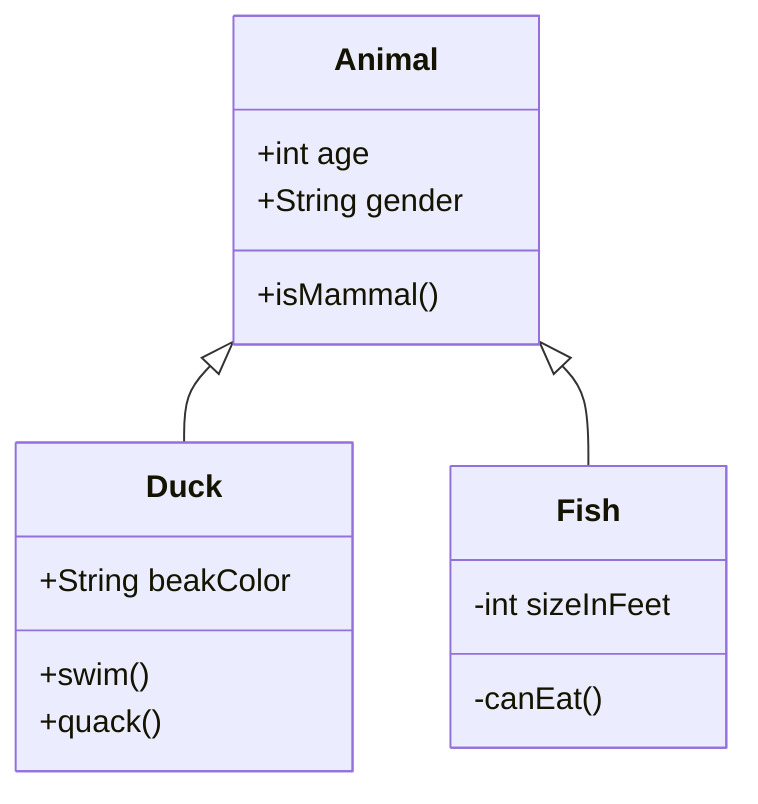
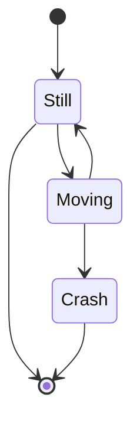
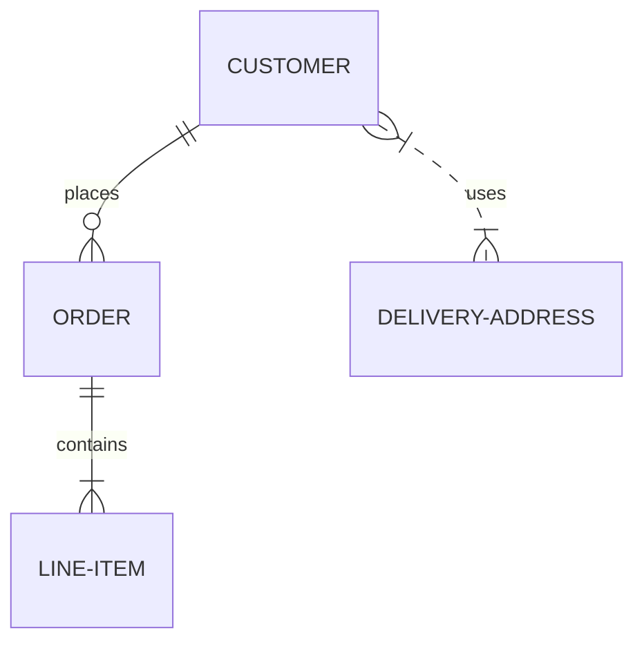
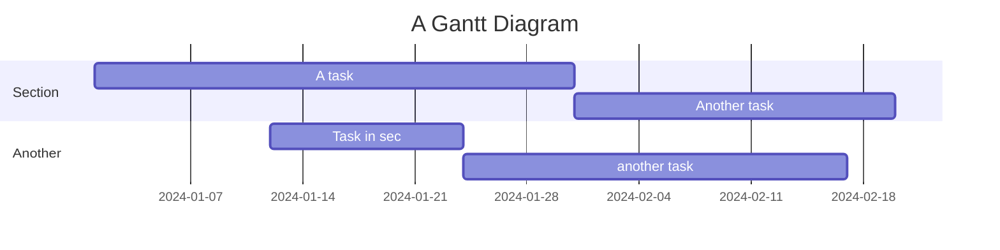
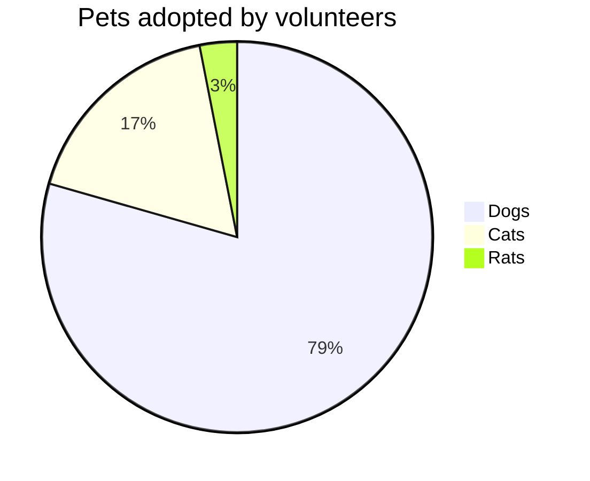
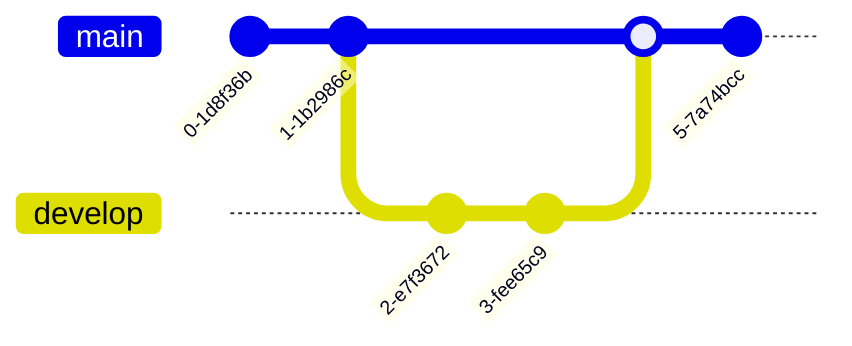
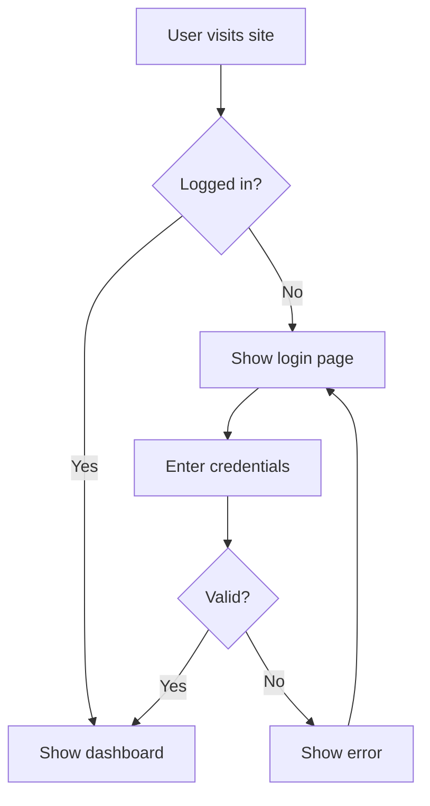

# Mermaid Diagram Support

This project now supports rendering [Mermaid](https://mermaid.js.org/) diagrams in markdown content, similar to how ThinkBlock components work.

## Features

- ✅ Automatic diagram rendering from markdown code blocks
- ✅ Theme-aware (light/dark mode support)
- ✅ Error handling with helpful error messages
- ✅ Lazy loading for optimal performance
- ✅ Support for all Mermaid diagram types
- ✅ Works in chat messages and markdown content

## Usage

There are **two ways** to render Mermaid diagrams:

### Method 1: Code Block (Recommended)

Use a markdown code block with the `mermaid` language identifier:

````markdown

````

This works in:
- ✅ Chat messages (CopilotKit Markdown)
- ✅ MarkdownRenderer component
- ✅ Any markdown content

### Method 2: Custom Tag (CopilotKit only)

Use the custom `<mermaid>` tag (similar to `<think>` blocks):

```xml
<mermaid>
graph TD
    A[Start] --> B[Process]
    B --> C{Decision}
</mermaid>
```

This works in:
- ✅ Chat messages (CopilotKit Markdown)
- ❌ Not supported in MarkdownRenderer

**Recommendation**: Use Method 1 (code blocks) for better compatibility and standard markdown syntax.

## Supported Diagram Types

### 1. Flowcharts

````markdown

````

### 2. Sequence Diagrams

````markdown

````

### 3. Class Diagrams

````markdown

````

### 4. State Diagrams

````markdown

````

### 5. Entity Relationship Diagrams

````markdown

````

### 6. Gantt Charts

````markdown

````

### 7. Pie Charts

````markdown

````

### 8. Git Graphs

````markdown

````

## Implementation Details

### Architecture

The Mermaid support follows the same pattern as the ThinkBlock component:

1. **MermaidBlock Component** (`/pages/side-panel/src/components/MermaidBlock.tsx`)
   - Lazy loads the Mermaid library
   - Handles theme switching (light/dark)
   - Provides error handling and loading states
   - Uses `useEffect` for diagram rendering

2. **MarkdownRenderer Integration** (`/pages/side-panel/src/components/tiptap/MarkdownRenderer.tsx`)
   - Intercepts code blocks with `language-mermaid`
   - Renders `<MermaidBlock>` instead of syntax highlighting
   - Maintains compatibility with other code blocks

3. **Styling** (`/pages/side-panel/src/SidePanel.css`)
   - Theme-aware styling
   - Responsive design
   - Error state styling
   - Loading animations

### Theme Support

The component automatically adapts to your theme:
- **Light mode**: Uses Mermaid's default theme
- **Dark mode**: Uses Mermaid's dark theme

### Error Handling

If a diagram has syntax errors, the component will:
1. Display a user-friendly error message
2. Show the original code in a collapsible section for debugging
3. Provide visual indicators (icon, color coding)

### Performance Optimization

- **Lazy Loading**: Mermaid library (~1MB) is loaded on-demand
- **Caching**: Once loaded, the library is cached for subsequent diagrams
- **Dynamic Imports**: Uses ES6 dynamic imports for code splitting

## Examples in Chat

You can use these diagrams in chat messages. The AI can generate them for you:

**User prompt examples:**
- "Create a flowchart showing the authentication process"
- "Draw a sequence diagram for the API call flow"
- "Generate a class diagram for the user management system"

**AI response example:**
````markdown
Here's a flowchart showing the authentication process:


````

## Browser Compatibility

Mermaid diagrams work in all modern browsers:
- ✅ Chrome/Edge (Chromium)
- ✅ Firefox
- ✅ Safari
- ✅ Opera

## Troubleshooting

### Diagram doesn't render

1. Check the syntax using [Mermaid Live Editor](https://mermaid.live/)
2. Ensure the code block has the `mermaid` language identifier
3. Check browser console for error messages

### Performance issues

For very complex diagrams:
1. Simplify the diagram structure
2. Split into multiple smaller diagrams
3. Consider using images for very large diagrams

### Theme not applying

The component uses `useStorage(exampleThemeStorage)` to detect theme. Ensure:
1. Theme storage is properly initialized
2. Theme changes trigger re-renders

## Resources

- [Mermaid Documentation](https://mermaid.js.org/)
- [Mermaid Live Editor](https://mermaid.live/) - Test your diagrams
- [Mermaid Cheat Sheet](https://jojozhuang.github.io/tutorial/mermaid-cheat-sheet/)

## Technical Notes

### Security

- Uses `securityLevel: 'strict'` to prevent XSS attacks
- Validates diagram syntax before rendering
- Sanitizes all user input

### Dependencies

```json
{
  "mermaid": "^10.9.1"
}
```

### Component API

```typescript
interface MermaidBlockProps {
  children?: React.ReactNode; // Mermaid diagram syntax
}
```

## Future Enhancements

Potential improvements for future versions:
- [ ] Add zoom/pan controls for large diagrams
- [ ] Export diagrams as PNG/SVG
- [ ] Diagram editing capabilities
- [ ] Custom theme configuration
- [ ] Diagram templates library

