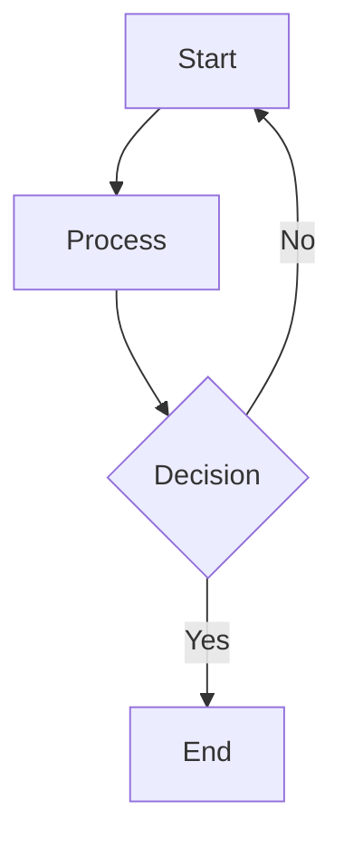

# Mermaid Toggle Feature & Styling Updates

## ✅ Implemented Features

### 1. **Rounded Corners** 🎨
- **Node radius**: Increased from `8px` to `12px` for a softer, more modern look
- Applied to all node shapes (rectangles, circles, etc.)
- CSS override ensures consistent rounding

### 2. **Removed Node Borders** 🚫
- All node borders set to `transparent`
- Clean, borderless look
- Applied to:
  - Primary nodes
  - Secondary nodes
  - Tertiary nodes
  - Note boxes

### 3. **Full Edge Label Backgrounds** 📦
- Edge labels now have complete background coverage
- `edgeLabelBackground`: `rgba(255, 255, 255, 0.95)` (light) / `rgba(31, 41, 55, 0.95)` (dark)
- Padding: `4px 8px` for comfortable spacing
- Border radius: `4px` for rounded label backgrounds
- Labels are no longer truncated

### 4. **Toggle Button** 🔄

#### Features:
- **Position**: Top right corner of each diagram
- **States**:
  - Default: Shows "Show Code" button with code icon
  - Toggled: Shows "Show Diagram" button with eye icon
  
#### Styling:
- Semi-transparent background with backdrop blur
- Smooth hover effects
- Theme-aware colors
- Icons for visual clarity

#### Functionality:
- Click to toggle between:
  - **Rendered diagram** (default)
  - **Raw mermaid code** (syntax)
- Code view features:
  - Monospace font
  - Syntax-highlighted appearance
  - Proper line breaks
  - Copy-friendly format

---

## How to Use

### Viewing a Diagram

1. **Default View**: Diagram renders automatically
2. **Toggle to Code**: Click "Show Code" button in top-right
3. **Back to Diagram**: Click "Show Diagram" button

### Button States

**Show Code Button** (Diagram visible):
```
┌─────────────────┐
│ </> Show Code   │
└─────────────────┘
```

**Show Diagram Button** (Code visible):
```
┌─────────────────┐
│ 👁  Show Diagram │
└─────────────────┘
```

---

## Example Usage

````markdown

````

**Result:**
- Beautiful borderless nodes with 12px rounded corners
- Clean edge labels with full backgrounds
- Toggle button in top-right corner
- Click to switch between diagram and code

---

## Technical Details

### Component State
```typescript
const [showRaw, setShowRaw] = useState(false);
```

### Toggle Logic
```typescript
onClick={() => setShowRaw(!showRaw)}
```

### Conditional Rendering
```typescript
// Diagram view
<div style={{ display: !showRaw ? 'block' : 'none' }}>
  {/* SVG content */}
</div>

// Code view
{showRaw && (
  <pre>{content}</pre>
)}
```

---

## Styling Updates

### Theme Variables
```typescript
{
  primaryBorderColor: 'transparent',      // No borders
  secondaryBorderColor: 'transparent',    // No borders
  tertiaryBorderColor: 'transparent',     // No borders
  nodeRadius: 12,                         // Rounded corners
  edgeLabelBackground: 'rgba(255, 255, 255, 0.95)', // Full label bg
}
```

### CSS Overrides
```css
/* Remove all node borders */
.mermaid-block svg .node rect {
  stroke: transparent !important;
  rx: 12 !important;  /* Rounded corners */
}

/* Full background for edge labels */
.mermaid-block svg .edgeLabel rect {
  fill: var(--edge-label-bg);
  padding: 4px 8px;
}
```

---

## Visual Design

### Toggle Button Appearance

**Light Mode:**
- Background: `rgba(255, 255, 255, 0.9)`
- Border: Subtle gray
- Text: `#6b7280`
- Hover: Slightly darker background

**Dark Mode:**
- Background: `rgba(31, 41, 55, 0.9)`
- Border: Subtle gray
- Text: `#9ca3af`
- Hover: Slightly lighter background

### Code View

**Light Mode:**
```
┌────────────────────────────┐
│ graph TD                   │
│     A[Start] --> B[End]    │
└────────────────────────────┘
Background: #f9fafb
Text: #1f2937
```

**Dark Mode:**
```
┌────────────────────────────┐
│ graph TD                   │
│     A[Start] --> B[End]    │
└────────────────────────────┘
Background: #1f2937
Text: #f3f4f6
```

---

## Benefits

### For Users:
- ✅ **Cleaner diagrams** without border clutter
- ✅ **Modern aesthetic** with rounded corners
- ✅ **Easy code access** for learning/debugging
- ✅ **Copy-paste friendly** raw code view

### For Developers:
- ✅ **Inspect diagram syntax** without errors
- ✅ **Debug rendering issues** by comparing code/diagram
- ✅ **Learn mermaid syntax** by viewing examples
- ✅ **Copy diagrams** for documentation

---

## Accessibility

- **Keyboard accessible**: Button can be focused and activated with Enter/Space
- **Screen reader friendly**: Button has clear labels
- **Visual indicators**: Icons help distinguish states
- **High contrast**: Works in light and dark modes

---

## Performance

- **No re-rendering**: Toggle only changes visibility, doesn't re-render SVG
- **Lightweight**: Simple state toggle
- **Fast**: Instant switch between views
- **Memory efficient**: Both views share same content

---

## Future Enhancements

Possible additions:
- [ ] Copy button for raw code
- [ ] Export diagram as PNG/SVG
- [ ] Download raw code as `.mmd` file
- [ ] Share diagram URL
- [ ] Edit mode (live preview)

---

## Testing

### Test Cases:

1. **Toggle Functionality**
   - ✅ Click "Show Code" → displays raw code
   - ✅ Click "Show Diagram" → displays rendered diagram
   - ✅ Button text/icon changes correctly

2. **Styling**
   - ✅ Nodes have no borders
   - ✅ Corners are rounded (12px)
   - ✅ Edge labels have full backgrounds
   - ✅ Toggle button appears in top-right

3. **Theme Support**
   - ✅ Works in light mode
   - ✅ Works in dark mode
   - ✅ Smooth transitions

4. **Edge Cases**
   - ✅ Loading state (no button)
   - ✅ Error state (no button)
   - ✅ Empty diagram (no button)

---

## Summary

**All requested features implemented:**
1. ✅ Rounded corners (12px)
2. ✅ No node borders (transparent)
3. ✅ Full edge label backgrounds
4. ✅ Toggle button for code/diagram view

**Result**: Modern, clean mermaid diagrams with powerful toggle functionality!

