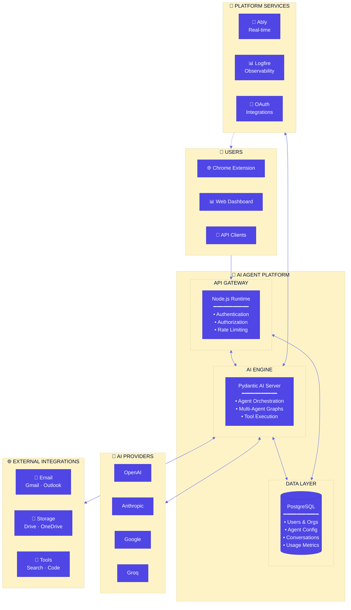
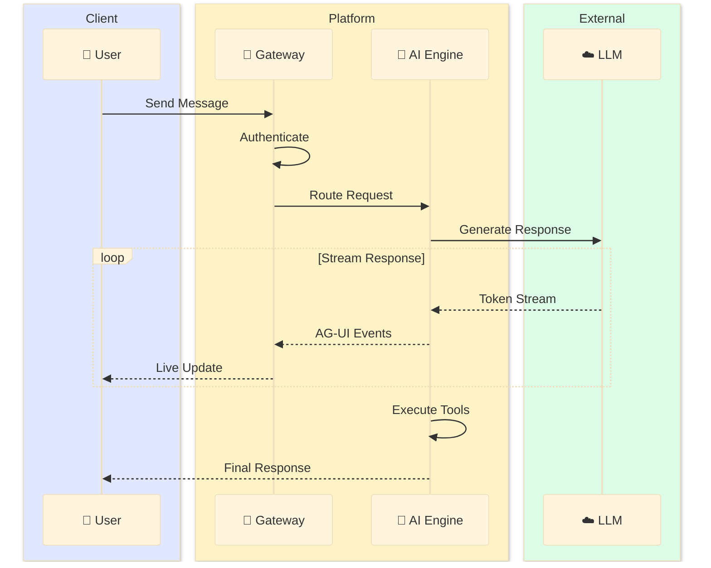

# AI Agent Platform - Executive Architecture

## System Overview



---

## Key Capabilities

| Capability | Description |
|:-----------|:------------|
| **🤖 Multi-Model AI** | Seamlessly switch between OpenAI, Anthropic, Google, and Groq models |
| **🏢 Multi-Tenancy** | Full organization and team isolation with RBAC |
| **⚡ Real-Time** | Live streaming responses via Ably and SSE |
| **🔧 Extensible Tools** | Built-in + custom tools via MCP protocol |
| **📊 Observability** | End-to-end tracing with Pydantic Logfire |
| **🔐 Enterprise Security** | OAuth 2.0, AES-256 encryption, audit logging |

---

## Data Flow



---

## Technology Highlights

### Performance
- **< 100ms** API response time (p50)
- **< 2s** time to first AI token
- **99.9%** uptime SLA

### Scale
- **Horizontal scaling** for both Node.js and Python servers
- **PostgreSQL** with read replicas for high availability
- **Connection pooling** for database efficiency

### Security
- **Zero trust** authentication architecture
- **AES-256-GCM** encryption for all credentials
- **SOC 2** compliant audit logging

---

## Component Stack

```
┌─────────────────────────────────────────────────────────────┐
│                      CLIENT LAYER                           │
│  ┌─────────────┐  ┌─────────────┐  ┌─────────────┐         │
│  │   Chrome    │  │    Web      │  │   REST      │         │
│  │  Extension  │  │  Dashboard  │  │    API      │         │
│  └─────────────┘  └─────────────┘  └─────────────┘         │
└─────────────────────────────────────────────────────────────┘
                              │
                              ▼
┌─────────────────────────────────────────────────────────────┐
│                    API GATEWAY (Node.js)                     │
│  ┌─────────────┐  ┌─────────────┐  ┌─────────────┐         │
│  │   Hono/     │  │   Better    │  │   Agent     │         │
│  │  Express    │  │    Auth     │  │  Runners    │         │
│  └─────────────┘  └─────────────┘  └─────────────┘         │
└─────────────────────────────────────────────────────────────┘
                              │
                              ▼
┌─────────────────────────────────────────────────────────────┐
│                   AI ENGINE (Python/FastAPI)                 │
│  ┌─────────────┐  ┌─────────────┐  ┌─────────────┐         │
│  │   Agent     │  │ Multi-Agent │  │    Tool     │         │
│  │  Factory    │  │   Graphs    │  │   Manager   │         │
│  └─────────────┘  └─────────────┘  └─────────────┘         │
└─────────────────────────────────────────────────────────────┘
                              │
              ┌───────────────┼───────────────┐
              ▼               ▼               ▼
┌───────────────────┐ ┌─────────────┐ ┌─────────────────────┐
│    PostgreSQL     │ │  AI Models  │ │  External Services  │
│  ┌─────────────┐  │ │ ┌─────────┐ │ │ ┌─────────────────┐ │
│  │ Users/Orgs  │  │ │ │ OpenAI  │ │ │ │      Ably       │ │
│  │ Agents/Cfg  │  │ │ │Anthropic│ │ │ │    Logfire      │ │
│  │  Threads    │  │ │ │ Google  │ │ │ │  OAuth/MCP      │ │
│  │   Usage     │  │ │ │  Groq   │ │ │ └─────────────────┘ │
│  └─────────────┘  │ │ └─────────┘ │ └─────────────────────┘
└───────────────────┘ └─────────────┘
```

---

*For technical implementation details, see the full [Architecture Documentation](./ARCHITECTURE.md)*
