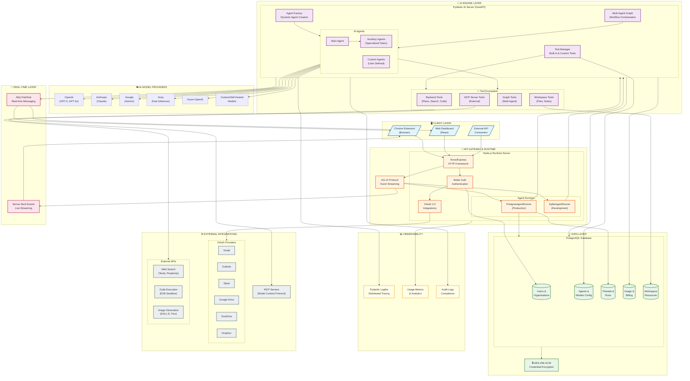
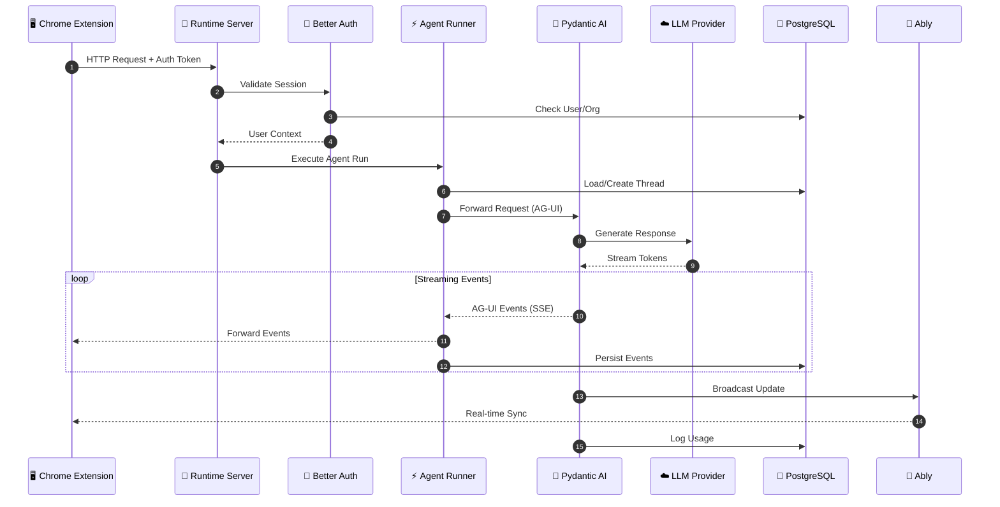
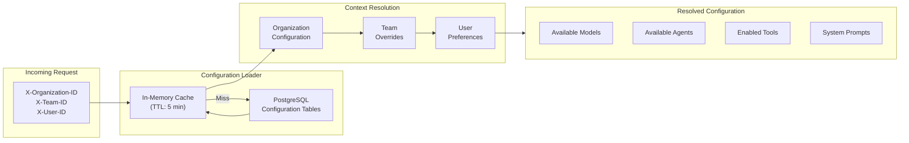
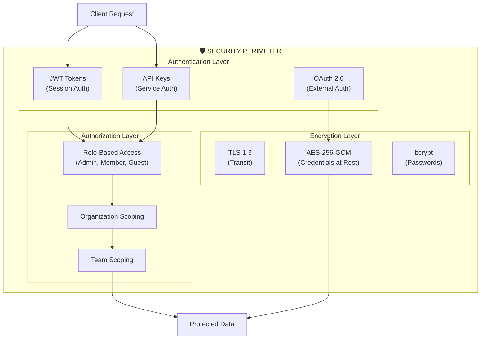
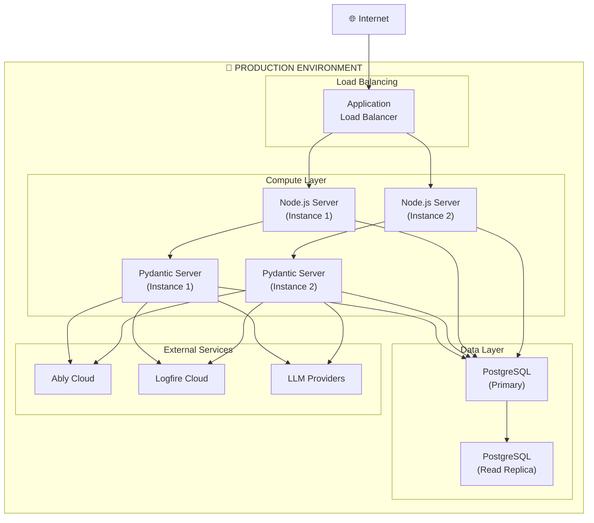

# System Architecture

## Executive Overview

This document provides a high-level architectural overview of the AI Agent Platform, designed for enterprise deployment with multi-tenancy, real-time collaboration, and comprehensive observability.

---

## High-Level Architecture Diagram

---

## Component Overview

### 🖥️ Client Layer
| Component | Technology | Purpose |
|-----------|------------|---------|
| Chrome Extension | JavaScript/React | Primary user interface for AI interactions |
| Web Dashboard | React | Administration, configuration, and analytics |
| External API | REST/SSE | Programmatic access for integrations |

### 🔐 API Gateway & Runtime
| Component | Technology | Purpose |
|-----------|------------|---------|
| HTTP Server | Hono + Express | High-performance request handling |
| Authentication | Better Auth | User, organization, and team management |
| OAuth Handler | OAuth 2.0 | Third-party service integrations |
| PostgresAgentRunner | Node.js + pg | Production-grade agent state persistence |
| AG-UI Protocol | SSE | Real-time bidirectional event streaming |

### 🤖 AI Engine Layer
| Component | Technology | Purpose |
|-----------|------------|---------|
| Agent Factory | Pydantic AI | Dynamic agent instantiation with context |
| Multi-Agent Graph | Custom Orchestration | Complex workflow execution |
| Tool Manager | Python | Built-in and custom tool registration |
| Auxiliary Agents | Pydantic AI | Specialized sub-agents for specific tasks |

### ☁️ AI Model Providers
| Provider | Models | Use Case |
|----------|--------|----------|
| OpenAI | GPT-4, GPT-4o, o1 | General purpose, reasoning |
| Anthropic | Claude 3.5, Claude 4 | Analysis, long context |
| Google | Gemini Pro, Flash | Multimodal, fast inference |
| Groq | Llama, Mixtral | Ultra-low latency |
| Azure OpenAI | GPT-4 | Enterprise compliance |

### 💾 Data Layer
| Store | Technology | Data |
|-------|------------|------|
| Users & Organizations | PostgreSQL | Identity, memberships, permissions |
| Agents & Models | PostgreSQL | Configuration, prompts, settings |
| Threads & Runs | PostgreSQL | Conversation history, agent state |
| Usage & Billing | PostgreSQL | Token counts, costs, analytics |
| Workspace Resources | PostgreSQL | Files, notes, connections |
| Credential Encryption | AES-256-GCM | Secure token storage |

### 📡 Real-Time Layer
| Component | Technology | Purpose |
|-----------|------------|---------|
| Ably Pub/Sub | Ably Cloud | Cross-client real-time sync |
| Server-Sent Events | HTTP SSE | Agent response streaming |

### 📊 Observability
| Component | Technology | Purpose |
|-----------|------------|---------|
| Distributed Tracing | Pydantic Logfire | Request tracing, performance monitoring |
| Usage Metrics | Custom | Token usage, cost tracking |
| Audit Logs | PostgreSQL | Compliance, security events |

### 🌐 External Integrations
| Category | Services | Purpose |
|----------|----------|---------|
| Email | Gmail, Outlook | Email management tools |
| Storage | Google Drive, OneDrive, Dropbox | File access tools |
| Communication | Slack | Messaging tools |
| AI Services | Tavily, Perplexity, E2B, DALL-E | Enhanced capabilities |
| MCP Servers | Custom | Extensible tool integration |

---

## Data Flow Diagrams

### Request Processing Flow

### Multi-Tenant Configuration Flow

---

## Security Architecture

---

## Deployment Architecture

---

## Key Metrics & SLAs

| Metric | Target | Measurement |
|--------|--------|-------------|
| API Latency (p50) | < 100ms | Response time excluding LLM |
| API Latency (p99) | < 500ms | Response time excluding LLM |
| First Token Latency | < 2s | Time to first streamed token |
| System Uptime | 99.9% | Monthly availability |
| Data Durability | 99.999% | PostgreSQL replication |
| Event Delivery | 99.99% | Ably SLA |

---

## Technology Stack Summary

| Layer | Technologies |
|-------|-------------|
| **Frontend** | Chrome Extension (JavaScript/React), Web Dashboard (React) |
| **API Gateway** | Node.js, Hono, Express |
| **AI Engine** | Python, FastAPI, Pydantic AI |
| **Database** | PostgreSQL 15+, SQLite (dev) |
| **Authentication** | Better Auth, OAuth 2.0, JWT |
| **Real-time** | Ably, Server-Sent Events |
| **Observability** | Pydantic Logfire, Custom Metrics |
| **AI Providers** | OpenAI, Anthropic, Google, Groq, Azure |
| **Security** | TLS 1.3, AES-256-GCM, bcrypt |

---

*Document generated for executive presentation. For technical implementation details, see component-specific documentation.*
